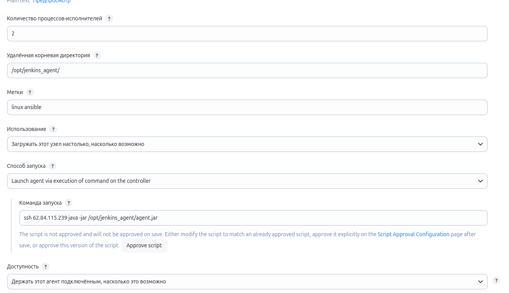
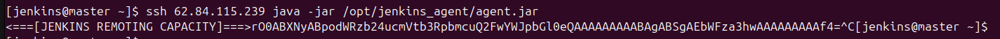

Повторяю действия из видео урока "Практика Jenkins", дошёл до момента добавления агента:

При сохранении появляется такое сообщение:

Проверяю из командной строки ту же команду:

Видно, что связь есть и работает.
В чём может быть проблема?

